# Architecture Technique - PowerShell Admin ToolBox 🏗️

## 🎯 Principes Architecturaux

### Contraintes Fondamentales
- **PowerShell Core 7.5+ uniquement** - Aucun code C# ou DLL externe
- **Framework .NET 9.0 minimum** - Technologies les plus récentes
- **MVVM strict** - Séparation totale View/ViewModel/Model
- **Modularité maximale** - Extensibilité sans modification du cœur
- **Sécurité par conception** - Pas de secrets dans le code source

### Design Patterns Adoptés
- **MVVM (Model-View-ViewModel)** : Pattern principal pour l'interface
- **Module Pattern** : Isolation et extensibilité des fonctionnalités
- **Observer Pattern** : Communication inter-modules via EventAggregator
- **Command Pattern** : Actions utilisateur via ICommand
- **Repository Pattern** : Abstraction accès aux données

## 🧩 Architecture Globale


## 🔧 Module Core - Fondations

### Composants Centraux

#### 1. ModuleLoader - Chargement Dynamique
```powershell
class ModuleLoader {
    [hashtable] $LoadedModules = @{}
    [string] $ModulesPath = ".\src\Modules"
    
    # Découverte automatique des modules
    [array] DiscoverModules() {
        $manifestFiles = Get-ChildItem -Path $this.ModulesPath -Filter "*.psd1" -Recurse
        
        $availableModules = foreach ($manifest in $manifestFiles) {
            $moduleData = Import-PowerShellDataFile -Path $manifest.FullName
            
            if ($moduleData.PrivateData.ToolBoxModule) {
                [PSCustomObject]@{
                    Name = $moduleData.ModuleList[0]
                    DisplayName = $moduleData.PrivateData.ToolBoxModule.DisplayName
                    Category = $moduleData.PrivateData.ToolBoxModule.Category
                    RequiredPermissions = $moduleData.PrivateData.ToolBoxModule.RequiredPermissions
                    WindowType = $moduleData.PrivateData.ToolBoxModule.WindowType
                    ManifestPath = $manifest.FullName
                }
            }
        }
        
        return $availableModules
    }
    
    # Chargement sécurisé d'un module
    [bool] LoadModule([string] $moduleName) {
        try {
            $moduleManifest = $this.GetModuleManifest($moduleName)
            
            # Vérification permissions
            if (-not $this.CheckPermissions($moduleManifest.RequiredPermissions)) {
                Write-ToolBoxLog -Message "Permissions insuffisantes pour $moduleName" -Level "Warning"
                return $false
            }
            
            # Import du module
            Import-Module -Name $moduleManifest.ManifestPath -Force
            $this.LoadedModules[$moduleName] = $moduleManifest
            
            Write-ToolBoxLog -Message "Module $moduleName chargé avec succès" -Level "Info"
            return $true
        }
        catch {
            Write-ToolBoxLog -Message "Erreur chargement $moduleName : $($_.Exception.Message)" -Level "Error"
            return $false
        }
    }
}
```

#### 2. EventAggregator - Communication Inter-Modules
```powershell
class EventAggregator {
    [hashtable] $Subscriptions = @{}
    
    # Abonnement à un événement
    [void] Subscribe([string] $eventType, [scriptblock] $handler) {
        if (-not $this.Subscriptions.ContainsKey($eventType)) {
            $this.Subscriptions[$eventType] = @()
        }
        
        $this.Subscriptions[$eventType] += $handler
    }
    
    # Publication d'événement
    [void] Publish([string] $eventType, [object] $eventData) {
        if ($this.Subscriptions.ContainsKey($eventType)) {
            foreach ($handler in $this.Subscriptions[$eventType]) {
                try {
                    & $handler $eventData
                }
                catch {
                    Write-ToolBoxLog -Message "Erreur handler événement $eventType : $($_.Exception.Message)" -Level "Error"
                }
            }
        }
    }
}
```

#### 3. ProcessService - Gestion Processus Isolés
```powershell
class ProcessService {
    [hashtable] $RunningProcesses = @{}
    
    # Démarrage processus PowerShell isolé
    [string] StartProcess([scriptblock] $scriptBlock, [hashtable] $parameters = @{}) {
        $processId = [System.Guid]::NewGuid().ToString()
        
        # Création job PowerShell
        $powerShell = [System.Management.Automation.PowerShell]::Create()
        
        # Ajout du script et paramètres
        $powerShell.AddScript($scriptBlock.ToString())
        foreach ($param in $parameters.GetEnumerator()) {
            $powerShell.AddParameter($param.Key, $param.Value)
        }
        
        # Démarrage asynchrone
        $asyncResult = $powerShell.BeginInvoke()
        
        $this.RunningProcesses[$processId] = @{
            PowerShell = $powerShell
            AsyncResult = $asyncResult
            StartTime = Get-Date
            Status = "Running"
        }
        
        Write-ToolBoxLog -Message "Processus $processId démarré" -Level "Info"
        return $processId
    }
    
    # Vérification statut processus
    [object] GetProcessStatus([string] $processId) {
        if ($this.RunningProcesses.ContainsKey($processId)) {
            $process = $this.RunningProcesses[$processId]
            
            if ($process.AsyncResult.IsCompleted) {
                $process.Status = "Completed"
                $process.EndTime = Get-Date
                $process.Result = $process.PowerShell.EndInvoke($process.AsyncResult)
                
                if ($process.PowerShell.HadErrors) {
                    $process.Errors = $process.PowerShell.Streams.Error
                    $process.Status = "Error"
                }
            }
            
            return $process
        }
        
        return $null
    }
}
```

## 🎨 Interface Utilisateur - Architecture MVVM

### Structure MVVM en PowerShell

#### ViewModelBase - Classe de Base
```powershell
class ViewModelBase : System.ComponentModel.INotifyPropertyChanged {
    # Événement standard INotifyPropertyChanged
    [System.ComponentModel.PropertyChangedEventHandler] $PropertyChanged
    
    # Services injectés
    [EventAggregator] $EventAggregator
    [LoggingService] $LoggingService
    [ConfigurationService] $ConfigurationService
    
    # Constructor avec injection dépendances
    ViewModelBase([EventAggregator] $eventAggregator, [LoggingService] $loggingService, [ConfigurationService] $configService) {
        $this.EventAggregator = $eventAggregator
        $this.LoggingService = $loggingService
        $this.ConfigurationService = $configService
    }
    
    # Notification changement propriété
    [void] OnPropertyChanged([string] $propertyName) {
        if ($this.PropertyChanged) {
            $eventArgs = [System.ComponentModel.PropertyChangedEventArgs]::new($propertyName)
            $this.PropertyChanged.Invoke($this, $eventArgs)
        }
    }
    
    # Setter avec notification automatique
    [bool] SetProperty([ref] $field, [object] $value, [string] $propertyName) {
        if (-not [object]::Equals($field.Value, $value)) {
            $field.Value = $value
            $this.OnPropertyChanged($propertyName)
            return $true
        }
        return $false
    }
    
    # Méthodes virtuelles pour cycle de vie
    [void] Initialize() { }
    [void] Cleanup() { }
}
```

#### RelayCommand - Implémentation ICommand
```powershell
class RelayCommand : System.Windows.Input.ICommand {
    [scriptblock] $ExecuteAction
    [scriptblock] $CanExecuteAction
    
    # Événement CanExecuteChanged
    [System.EventHandler] $CanExecuteChanged
    
    # Constructor
    RelayCommand([scriptblock] $executeAction, [scriptblock] $canExecuteAction = $null) {
        $this.ExecuteAction = $executeAction
        $this.CanExecuteAction = $canExecuteAction
    }
    
    # Implémentation ICommand.Execute
    [void] Execute([object] $parameter) {
        if ($this.ExecuteAction) {
            & $this.ExecuteAction $parameter
        }
    }
    
    # Implémentation ICommand.CanExecute
    [bool] CanExecute([object] $parameter) {
        if ($this.CanExecuteAction) {
            return & $this.CanExecuteAction $parameter
        }
        return $true
    }
    
    # Déclencher réévaluation CanExecute
    [void] RaiseCanExecuteChanged() {
        if ($this.CanExecuteChanged) {
            $this.CanExecuteChanged.Invoke($this, [System.EventArgs]::Empty)
        }
    }
}
```

### Exemple ViewModel Complet
```powershell
class UserManagementViewModel : ViewModelBase {
    # Propriétés bindées
    [string] $UserName = ""
    [string] $FirstName = ""
    [string] $LastName = ""
    [string] $Email = ""
    [bool] $IsProcessing = $false
    [int] $ProgressValue = 0
    [System.Collections.ObjectModel.ObservableCollection[object]] $LogEntries
    
    # Commands
    [System.Windows.Input.ICommand] $CreateUserCommand
    [System.Windows.Input.ICommand] $DisableUserCommand
    [System.Windows.Input.ICommand] $ExportUsersCommand
    
    # Services spécialisés
    [UserService] $UserService
    [ProcessService] $ProcessService
    
    # Constructor
    UserManagementViewModel(
        [EventAggregator] $eventAggregator,
        [LoggingService] $loggingService,
        [ConfigurationService] $configService,
        [UserService] $userService,
        [ProcessService] $processService
    ) : base($eventAggregator, $loggingService, $configService) {
        
        $this.UserService = $userService
        $this.ProcessService = $processService
        $this.LogEntries = [System.Collections.ObjectModel.ObservableCollection[object]]::new()
        
        $this.InitializeCommands()
        $this.SubscribeToEvents()
    }
    
    # Initialisation des commandes
    [void] InitializeCommands() {
        $this.CreateUserCommand = [RelayCommand]::new(
            { $this.CreateUser() },
            { $this.CanCreateUser() }
        )
        
        $this.DisableUserCommand = [RelayCommand]::new(
            { $this.DisableUser() },
            { $this.CanDisableUser() }
        )
        
        $this.ExportUsersCommand = [RelayCommand]::new(
            { $this.ExportUsers() },
            { -not $this.IsProcessing }
        )
    }
    
    # Abonnement aux événements
    [void] SubscribeToEvents() {
        $this.EventAggregator.Subscribe("ProcessCompleted", {
            param($eventData)
            $this.OnProcessCompleted($eventData)
        })
        
        $this.EventAggregator.Subscribe("LogEntry", {
            param($logEntry)
            $this.LogEntries.Add($logEntry)
        })
    }
    
    # Actions principales
    [void] CreateUser() {
        try {
            $this.IsProcessing = $true
            $this.OnPropertyChanged("IsProcessing")
            
            $scriptBlock = {
                param($userName, $firstName, $lastName, $email)
                
                # Import modules nécessaires
                Import-Module ActiveDirectory
                Import-Module Microsoft.Graph
                
                # Logique création utilisateur
                $userParams = @{
                    Name = "$firstName $lastName"
                    GivenName = $firstName
                    Surname = $lastName
                    UserPrincipalName = $email
                    SamAccountName = $userName
                    Enabled = $true
                }
                
                New-ADUser @userParams
                
                # Autres opérations...
                return @{
                    Success = $true
                    Message = "Utilisateur $userName créé avec succès"
                }
            }
            
            $parameters = @{
                userName = $this.UserName
                firstName = $this.FirstName
                lastName = $this.LastName
                email = $this.Email
            }
            
            $processId = $this.ProcessService.StartProcess($scriptBlock, $parameters)
            $this.MonitorProcess($processId)
            
        } catch {
            $this.LoggingService.WriteLog("Erreur création utilisateur : $($_.Exception.Message)", "Error")
        }
    }
    
    # Monitoring processus asynchrone
    [void] MonitorProcess([string] $processId) {
        $timer = [System.Windows.Threading.DispatcherTimer]::new()
        $timer.Interval = [TimeSpan]::FromMilliseconds(500)
        
        $timer.add_Tick({
            $status = $this.ProcessService.GetProcessStatus($processId)
            
            if ($status.Status -eq "Completed") {
                $this.IsProcessing = $false
                $this.OnPropertyChanged("IsProcessing")
                
                $this.EventAggregator.Publish("ProcessCompleted", $status.Result)
                $timer.Stop()
            }
            elseif ($status.Status -eq "Error") {
                $this.IsProcessing = $false
                $this.OnPropertyChanged("IsProcessing")
                
                foreach ($error in $status.Errors) {
                    $this.LoggingService.WriteLog($error.ToString(), "Error")
                }
                $timer.Stop()
            }
        })
        
        $timer.Start()
    }
}
```

## 📦 Architecture Modulaire

### Structure Standard d'un Module
```
ModuleName/
├── ModuleName.psd1                 # Manifest avec métadonnées ToolBox
├── ModuleName.psm1                 # Point d'entrée du module
├── ModuleNameWindow.xaml           # Interface utilisateur
├── ModuleNameViewModel.ps1         # ViewModel MVVM
├── Functions/
│   ├── Public/                     # Fonctions exportées
│   └── Private/                    # Fonctions internes
├── Classes/                        # Classes métier du module
├── Resources/                      # Ressources spécifiques
└── Tests/                          # Tests unitaires du module
```

### Manifest Module Standard
```powershell
@{
    # Informations de base
    RootModule = 'UserManagement.psm1'
    ModuleVersion = '1.0.0'
    GUID = '12345678-1234-1234-1234-123456789012'
    Author = 'PowerShell Admin ToolBox Team'
    CompanyName = 'Open Source Community'
    Copyright = '(c) 2025 PowerShell Admin ToolBox Contributors'
    Description = 'Module de gestion des utilisateurs AD et Azure'
    
    # Compatibilité
    PowerShellVersion = '7.5'
    DotNetFrameworkVersion = '9.0'
    
    # Dépendances
    RequiredModules = @(
        'PowerShellAdminToolBox.Core',
        'ActiveDirectory',
        'Microsoft.Graph'
    )
    
    # Exports
    FunctionsToExport = @(
        'New-ToolBoxUser',
        'Disable-ToolBoxUser',
        'Export-ToolBoxUsers'
    )
    
    CmdletsToExport = @()
    VariablesToExport = @()
    AliasesToExport = @()
    
    # Métadonnées ToolBox
    PrivateData = @{
        ToolBoxModule = @{
            # Affichage
            DisplayName = 'Gestion Utilisateurs'
            Description = 'Création, désactivation et export des utilisateurs AD/Azure'
            Category = 'Gestion Identités'
            Icon = 'Users'
            
            # Comportement
            WindowType = 'Floating'          # Floating | Embedded | Modal
            AllowMultipleInstances = $false
            
            # Sécurité
            RequiredPermissions = @('AdminSystem', 'UserManagement')
            RequiredModules = @('ActiveDirectory', 'Microsoft.Graph')
            
            # Interface
            HasConfigurationUI = $true
            HasProgressIndicator = $true
            HasLogOutput = $true
            
            # Métadonnées
            Version = '1.0.0'
            LastUpdated = '2025-01-01'
            Author = 'Admin Team'
        }
    }
}
```

## 🔐 Architecture Sécurité

### Gestion des Authentifications
```powershell
class AuthenticationService {
    [hashtable] $ActiveConnections = @{}
    [string] $AuthenticationMode = "UserPassword"  # UserPassword | Certificate
    [object] $CurrentUserContext
    
    # Authentification hybride selon configuration
    [bool] Connect([string] $service) {
        $config = Get-ToolBoxConfiguration
        
        switch ($config.Authentication.Mode) {
            "UserPassword" { 
                return $this.ConnectWithUserCredentials($service)
            }
            "Certificate" { 
                return $this.ConnectWithCertificate($service)
            }
            default { 
                throw "Mode d'authentification non supporté : $($config.Authentication.Mode)"
            }
        }
    }
    
    # Authentification utilisateur/mot de passe
    [bool] ConnectWithUserCredentials([string] $service) {
        try {
            switch ($service) {
                "ActiveDirectory" {
                    # Utilisation du contexte utilisateur courant
                    $domain = $env:USERDNSDOMAIN
                    $user = $env:USERNAME
                    
                    # Test connexion AD
                    $testResult = Test-ADAuthentication -Domain $domain -Username $user
                    if ($testResult) {
                        $this.ActiveConnections["ActiveDirectory"] = @{
                            Domain = $domain
                            Username = $user
                            ConnectedAt = Get-Date
                            Type = "Integrated"
                        }
                        return $true
                    }
                }
                
                "MicrosoftGraph" {
                    # Connexion Graph avec authentification déléguée
                    Connect-MgGraph -Scopes "User.ReadWrite.All", "Group.ReadWrite.All", "Directory.ReadWrite.All"
                    
                    $context = Get-MgContext
                    if ($context) {
                        $this.ActiveConnections["MicrosoftGraph"] = @{
                            TenantId = $context.TenantId
                            Account = $context.Account
                            ConnectedAt = Get-Date
                            Type = "Delegated"
                        }
                        return $true
                    }
                }
                
                "SharePointPnP" {
                    # Connexion PnP avec authentification intégrée
                    $siteUrl = Get-ToolBoxConfiguration | Select-Object -ExpandProperty SharePoint | Select-Object -ExpandProperty DefaultSiteUrl
                    Connect-PnPOnline -Url $siteUrl -Interactive
                    
                    $connection = Get-PnPConnection
                    if ($connection) {
                        $this.ActiveConnections["SharePointPnP"] = @{
                            Url = $siteUrl
                            ConnectedAt = Get-Date
                            Type = "Interactive"
                        }
                        return $true
                    }
                }
            }
            
            return $false
        }
        catch {
            Write-ToolBoxLog -Message "Erreur authentification $service : $($_.Exception.Message)" -Level "Error"
            return $false
        }
    }
    
    # Authentification par certificat
    [bool] ConnectWithCertificate([string] $service) {
        try {
            $config = Get-ToolBoxConfiguration
            $certConfig = $config.Authentication.Certificate
            
            switch ($service) {
                "MicrosoftGraph" {
                    Connect-MgGraph -TenantId $certConfig.TenantId `
                                   -ClientId $certConfig.ClientId `
                                   -CertificateThumbprint $certConfig.Thumbprint
                    
                    $context = Get-MgContext
                    if ($context) {
                        $this.ActiveConnections["MicrosoftGraph"] = @{
                            TenantId = $context.TenantId
                            ClientId = $certConfig.ClientId
                            ConnectedAt = Get-Date
                            Type = "Application"
                        }
                        return $true
                    }
                }
                
                "SharePointPnP" {
                    Connect-PnPOnline -Url $certConfig.SharePointUrl `
                                     -ClientId $certConfig.ClientId `
                                     -Thumbprint $certConfig.Thumbprint `
                                     -Tenant $certConfig.TenantId
                    
                    $connection = Get-PnPConnection
                    if ($connection) {
                        $this.ActiveConnections["SharePointPnP"] = @{
                            Url = $certConfig.SharePointUrl
                            ClientId = $certConfig.ClientId
                            ConnectedAt = Get-Date
                            Type = "Application"
                        }
                        return $true
                    }
                }
            }
            
            return $false
        }
        catch {
            Write-ToolBoxLog -Message "Erreur authentification certificat $service : $($_.Exception.Message)" -Level "Error"
            return $false
        }
    }
    
    # Vérification statut connexion
    [bool] IsConnected([string] $service) {
        if ($this.ActiveConnections.ContainsKey($service)) {
            $connection = $this.ActiveConnections[$service]
            
            # Vérification validité connexion (timeout 8 heures)
            $maxAge = (Get-Date).AddHours(-8)
            if ($connection.ConnectedAt -gt $maxAge) {
                return $true
            } else {
                # Connexion expirée, nettoyage
                $this.ActiveConnections.Remove($service)
            }
        }
        
        return $false
    }
}
```

### Gestion des Permissions
```powershell
class PermissionService {
    [hashtable] $UserPermissions = @{}
    [hashtable] $ModulePermissions = @{}
    
    # Initialisation permissions utilisateur
    [void] InitializeUserPermissions() {
        try {
            # Récupération groupes AD utilisateur courant
            $currentUser = [System.Security.Principal.WindowsIdentity]::GetCurrent()
            $principal = [System.Security.Principal.WindowsPrincipal]$currentUser
            
            # Vérification appartenance groupes administrateurs
            $this.UserPermissions["AdminSystem"] = $principal.IsInRole([System.Security.Principal.WindowsBuiltInRole]::Administrator)
            
            # Vérification groupes AD personnalisés
            $adGroups = Get-ADUser -Identity $env:USERNAME -Properties MemberOf | 
                       Select-Object -ExpandProperty MemberOf |
                       ForEach-Object { (Get-ADGroup -Identity $_).Name }
            
            $this.UserPermissions["UserManagement"] = $adGroups -contains "PowerShell-UserManagement"
            $this.UserPermissions["SharePointAdmin"] = $adGroups -contains "PowerShell-SharePointAdmin"
            $this.UserPermissions["ReportingUser"] = $adGroups -contains "PowerShell-ReportingUser"
            
            Write-ToolBoxLog -Message "Permissions utilisateur initialisées : $($this.UserPermissions | ConvertTo-Json)" -Level "Debug"
        }
        catch {
            Write-ToolBoxLog -Message "Erreur initialisation permissions : $($_.Exception.Message)" -Level "Error"
            # Permissions minimales par défaut
            $this.UserPermissions["BasicUser"] = $true
        }
    }
    
    # Vérification permission pour module
    [bool] CheckModulePermission([string] $moduleName) {
        if (-not $this.ModulePermissions.ContainsKey($moduleName)) {
            $this.LoadModulePermissions($moduleName)
        }
        
        $requiredPermissions = $this.ModulePermissions[$moduleName]
        
        foreach ($permission in $requiredPermissions) {
            if (-not $this.UserPermissions.ContainsKey($permission) -or -not $this.UserPermissions[$permission]) {
                Write-ToolBoxLog -Message "Permission manquante pour $moduleName : $permission" -Level "Warning"
                return $false
            }
        }
        
        return $true
    }
    
    # Chargement permissions module depuis manifest
    [void] LoadModulePermissions([string] $moduleName) {
        try {
            $manifestPath = ".\src\Modules\$moduleName\$moduleName.psd1"
            if (Test-Path $manifestPath) {
                $moduleData = Import-PowerShellDataFile -Path $manifestPath
                $this.ModulePermissions[$moduleName] = $moduleData.PrivateData.ToolBoxModule.RequiredPermissions
            } else {
                $this.ModulePermissions[$moduleName] = @("BasicUser")
            }
        }
        catch {
            Write-ToolBoxLog -Message "Erreur chargement permissions $moduleName : $($_.Exception.Message)" -Level "Error"
            $this.ModulePermissions[$moduleName] = @("AdminSystem")  # Sécurité par défaut
        }
    }
}
```

## 📊 Architecture Logging

### Système de Logs Unifié
```powershell
class LoggingService {
    [string] $LogPath = ".\logs"
    [string] $LogLevel = "Info"  # Debug, Info, Warning, Error
    [System.Collections.Concurrent.ConcurrentQueue[object]] $LogQueue
    [System.Threading.Timer] $FlushTimer
    [System.Management.Automation.Host.PSHost] $PowerShellHost
    
    # Constructor
    LoggingService([System.Management.Automation.Host.PSHost] $host) {
        $this.PowerShellHost = $host
        $this.LogQueue = [System.Collections.Concurrent.ConcurrentQueue[object]]::new()
        $this.InitializeLogSystem()
    }
    
    # Initialisation système logs
    [void] InitializeLogSystem() {
        # Création dossier logs
        if (-not (Test-Path $this.LogPath)) {
            New-Item -Path $this.LogPath -ItemType Directory -Force | Out-Null
        }
        
        # Timer pour flush périodique
        $this.FlushTimer = [System.Threading.Timer]::new(
            { $this.FlushLogs() },
            $null,
            [TimeSpan]::FromSeconds(5),
            [TimeSpan]::FromSeconds(5)
        )
        
        Write-Host "Système de logs initialisé - Path: $($this.LogPath)" -ForegroundColor Green
    }
    
    # Écriture log multi-destinations
    [void] WriteLog([string] $message, [string] $level = "Info", [hashtable] $destinations = @{}) {
        $logEntry = [PSCustomObject]@{
            Timestamp = Get-Date -Format "yyyy-MM-dd HH:mm:ss"
            Level = $level.ToUpper()
            Message = $message
            ProcessId = [System.Diagnostics.Process]::GetCurrentProcess().Id
            ThreadId = [System.Threading.Thread]::CurrentThread.ManagedThreadId
            Module = (Get-PSCallStack)[1].Command
        }
        
        # Ajout à la queue pour traitement asynchrone
        $this.LogQueue.Enqueue($logEntry)
        
        # Destinations immédiates
        if ($destinations.ContainsKey("Console") -and $destinations.Console) {
            $this.WriteToConsole($logEntry)
        }
        
        if ($destinations.ContainsKey("RichTextBox") -and $destinations.RichTextBox) {
            $this.WriteToRichTextBox($logEntry, $destinations.RichTextBox)
        }
    }
    
    # Écriture console avec colorisation
    [void] WriteToConsole([object] $logEntry) {
        $color = switch ($logEntry.Level) {
            "DEBUG" { "Gray" }
            "INFO" { "White" }
            "WARNING" { "Yellow" }
            "ERROR" { "Red" }
            default { "White" }
        }
        
        $formattedMessage = "[$($logEntry.Timestamp)] [$($logEntry.Level)] $($logEntry.Message)"
        
        if ($this.PowerShellHost) {
            $this.PowerShellHost.UI.WriteLine($color, $this.PowerShellHost.UI.RawUI.BackgroundColor, $formattedMessage)
        } else {
            Write-Host $formattedMessage -ForegroundColor $color
        }
    }
    
    # Écriture RichTextBox avec formatting
    [void] WriteToRichTextBox([object] $logEntry, [System.Windows.Controls.RichTextBox] $richTextBox) {
        $dispatcher = $richTextBox.Dispatcher
        
        $dispatcher.BeginInvoke([Action]{
            $document = $richTextBox.Document
            $paragraph = [System.Windows.Documents.Paragraph]::new()
            
            # Timestamp
            $timestampRun = [System.Windows.Documents.Run]::new("[$($logEntry.Timestamp)] ")
            $timestampRun.Foreground = [System.Windows.Media.Brushes]::Gray
            $paragraph.Inlines.Add($timestampRun)
            
            # Level avec couleur
            $levelRun = [System.Windows.Documents.Run]::new("[$($logEntry.Level)] ")
            $levelRun.FontWeight = [System.Windows.FontWeights]::Bold
            
            switch ($logEntry.Level) {
                "DEBUG" { $levelRun.Foreground = [System.Windows.Media.Brushes]::Gray }
                "INFO" { $levelRun.Foreground = [System.Windows.Media.Brushes]::Blue }
                "WARNING" { $levelRun.Foreground = [System.Windows.Media.Brushes]::Orange }
                "ERROR" { $levelRun.Foreground = [System.Windows.Media.Brushes]::Red }
            }
            $paragraph.Inlines.Add($levelRun)
            
            # Message
            $messageRun = [System.Windows.Documents.Run]::new($logEntry.Message)
            $paragraph.Inlines.Add($messageRun)
            
            $document.Blocks.Add($paragraph)
            
            # Auto-scroll vers le bas
            $richTextBox.ScrollToEnd()
            
            # Limitation nombre de lignes (performance)
            while ($document.Blocks.Count -gt 1000) {
                $document.Blocks.RemoveAt(0)
            }
        })
    }
    
    # Flush périodique vers fichiers
    [void] FlushLogs() {
        $logEntries = @()
        
        # Vidage queue
        while ($this.LogQueue.TryDequeue([ref]$logEntry)) {
            $logEntries += $logEntry
        }
        
        if ($logEntries.Count -gt 0) {
            $this.WriteToFile($logEntries)
        }
    }
    
    # Écriture fichier avec rotation
    [void] WriteToFile([array] $logEntries) {
        try {
            $logFile = Join-Path $this.LogPath "ToolBox_$(Get-Date -Format 'yyyy-MM-dd').log"
            
            $logLines = $logEntries | ForEach-Object {
                "[$($_.Timestamp)] [$($_.Level)] [$($_.Module)] $($_.Message)"
            }
            
            Add-Content -Path $logFile -Value $logLines -Encoding UTF8
            
            # Rotation logs (garder 30 jours)
            Get-ChildItem -Path $this.LogPath -Filter "ToolBox_*.log" |
                Where-Object { $_.CreationTime -lt (Get-Date).AddDays(-30) } |
                Remove-Item -Force
        }
        catch {
            Write-Warning "Erreur écriture logs : $($_.Exception.Message)"
        }
    }
    
    # Nettoyage ressources
    [void] Dispose() {
        if ($this.FlushTimer) {
            $this.FlushTimer.Dispose()
        }
        $this.FlushLogs()  # Flush final
    }
}
```

## ⚡ Architecture Performance

### Optimisations Clés

#### 1. Threading et Asynchrone
```powershell
# Utilisation PowerShell Jobs pour tâches longues
function Start-BackgroundTask {
    param(
        [scriptblock] $ScriptBlock,
        [hashtable] $Parameters = @{}
    )
    
    $job = Start-Job -ScriptBlock $scriptBlock -ArgumentList $Parameters
    
    return @{
        JobId = $job.Id
        Job = $job
        StartTime = Get-Date
    }
}

# Runspaces pour parallélisation
function Start-ParallelTasks {
    param(
        [array] $TaskList,
        [int] $MaxConcurrency = 5
    )
    
    $runspacePool = [runspacefactory]::CreateRunspacePool(1, $MaxConcurrency)
    $runspacePool.Open()
    
    $tasks = foreach ($task in $TaskList) {
        $powerShell = [powershell]::Create()
        $powerShell.RunspacePool = $runspacePool
        $powerShell.AddScript($task.ScriptBlock)
        
        @{
            PowerShell = $powerShell
            AsyncResult = $powerShell.BeginInvoke()
            Task = $task
        }
    }
    
    return $tasks
}
```

#### 2. Gestion Mémoire
```powershell
# Nettoyage automatique objets COM
function Invoke-ComObjectCleanup {
    [System.GC]::Collect()
    [System.GC]::WaitForPendingFinalizers()
    [System.GC]::Collect()
}

# Pool d'objets réutilisables
class ObjectPool {
    [System.Collections.Concurrent.ConcurrentQueue[object]] $Pool
    [scriptblock] $Factory
    [scriptblock] $ResetAction
    
    ObjectPool([scriptblock] $factory, [scriptblock] $resetAction = $null) {
        $this.Pool = [System.Collections.Concurrent.ConcurrentQueue[object]]::new()
        $this.Factory = $factory
        $this.ResetAction = $resetAction
    }
    
    [object] Get() {
        if ($this.Pool.TryDequeue([ref]$obj)) {
            if ($this.ResetAction) {
                & $this.ResetAction $obj
            }
            return $obj
        }
        
        return & $this.Factory
    }
    
    [void] Return([object] $obj) {
        if ($obj) {
            $this.Pool.Enqueue($obj)
        }
    }
}
```

#### 3. Cache Intelligent
```powershell
class CacheService {
    [System.Collections.Concurrent.ConcurrentDictionary[string, object]] $Cache
    [hashtable] $ExpirationTimes
    [System.Threading.Timer] $CleanupTimer
    
    CacheService() {
        $this.Cache = [System.Collections.Concurrent.ConcurrentDictionary[string, object]]::new()
        $this.ExpirationTimes = @{}
        
        # Nettoyage périodique
        $this.CleanupTimer = [System.Threading.Timer]::new(
            { $this.CleanupExpiredEntries() },
            $null,
            [TimeSpan]::FromMinutes(5),
            [TimeSpan]::FromMinutes(5)
        )
    }
    
    [void] Set([string] $key, [object] $value, [TimeSpan] $expiration) {
        $this.Cache.TryAdd($key, $value)
        $this.ExpirationTimes[$key] = (Get-Date).Add($expiration)
    }
    
    [object] Get([string] $key) {
        if ($this.ExpirationTimes.ContainsKey($key)) {
            if ((Get-Date) -gt $this.ExpirationTimes[$key]) {
                $this.Remove($key)
                return $null
            }
        }
        
        $value = $null
        $this.Cache.TryGetValue($key, [ref]$value)
        return $value
    }
    
    [void] Remove([string] $key) {
        $this.Cache.TryRemove($key, [ref]$null)
        $this.ExpirationTimes.Remove($key)
    }
    
    [void] CleanupExpiredEntries() {
        $now = Get-Date
        $expiredKeys = $this.ExpirationTimes.GetEnumerator() | 
                      Where-Object { $now -gt $_.Value } |
                      ForEach-Object { $_.Key }
        
        foreach ($key in $expiredKeys) {
            $this.Remove($key)
        }
    }
}
```

## 🧪 Architecture Tests

### Framework de Tests Intégré
```powershell
# Configuration Pester
$PesterConfig = @{
    Path = @(
        ".\tests\Unit\*.Tests.ps1",
        ".\tests\Integration\*.Tests.ps1"
    )
    Output = @{
        Verbosity = "Detailed"
        StackTraceVerbosity = "Filtered"
        CIFormat = "Auto"
    }
    CodeCoverage = @{
        Enabled = $true
        Path = ".\src\**\*.ps1"
        OutputFormat = "JaCoCo"
        OutputPath = ".\reports\coverage.xml"
    }
    TestResult = @{
        Enabled = $true
        OutputFormat = "NUnit2.5"
        OutputPath = ".\reports\testresults.xml"
    }
}
```

### Tests Architecture MVVM
```powershell
Describe "MVVM Architecture Tests" {
    Context "ViewModelBase" {
        It "Implémente INotifyPropertyChanged correctement" {
            $viewModel = [TestViewModel]::new()
            $propertyChanged = $false
            
            $viewModel.add_PropertyChanged({
                param($sender, $args)
                if ($args.PropertyName -eq "TestProperty") {
                    $propertyChanged = $true
                }
            })
            
            $viewModel.TestProperty = "NewValue"
            $propertyChanged | Should -Be $true
        }
        
        It "SetProperty notifie seulement si valeur change" {
            $viewModel = [TestViewModel]::new()
            $eventCount = 0
            
            $viewModel.add_PropertyChanged({
                $eventCount++
            })
            
            $viewModel.TestProperty = "Value1"
            $viewModel.TestProperty = "Value1"  # Même valeur
            $viewModel.TestProperty = "Value2"  # Valeur différente
            
            $eventCount | Should -Be 2
        }
    }
    
    Context "RelayCommand" {
        It "Execute appelle l'action fournie" {
            $executed = $false
            $command = [RelayCommand]::new({ $executed = $true })
            
            $command.Execute($null)
            $executed | Should -Be $true
        }
        
        It "CanExecute respecte la condition fournie" {
            $canExecute = $false
            $command = [RelayCommand]::new({ }, { $canExecute })
            
            $command.CanExecute($null) | Should -Be $false
            
            $canExecute = $true
            $command.CanExecute($null) | Should -Be $true
        }
    }
}
```

## 🔄 Flux de Données

### Communication Inter-Modules

```mermaid
sequenceDiagram
    participant UI as Interface Utilisateur
    participant VM as ViewModel
    participant EA as EventAggregator
    participant PS as ProcessService
    participant MOD as Module Métier
    participant API as API Externe
    
    UI->>VM: Action utilisateur (Command)
    VM->>EA: Publication événement "ProcessStarted"
    VM->>PS: Démarrage processus isolé
    PS->>MOD: Exécution logique métier
    MOD->>API: Appel API externe
    API-->>MOD: Réponse données
    MOD-->>PS: Résultat traitement
    PS->>EA: Publication événement "ProcessCompleted"
    EA->>VM: Notification résultat
    VM->>UI: Mise à jour interface (PropertyChanged)
```


### Cycle de Vie des Modules


---

## 📚 Ressources et Références

### Standards PowerShell
- [PowerShell Best Practices](https://docs.microsoft.com/powershell/scripting/dev-cross-plat/writing-portable-modules)
- [PowerShell Approved Verbs](https://docs.microsoft.com/powershell/scripting/developer/cmdlet/approved-verbs-for-windows-powershell-commands)
- [Advanced Functions](https://docs.microsoft.com/powershell/scripting/learn/deep-dives/everything-about-parameters)

### Architecture Patterns
- [MVVM Pattern](https://docs.microsoft.com/dotnet/architecture/modernize-desktop/example-migration-core)
- [Dependency Injection](https://docs.microsoft.com/dotnet/core/extensions/dependency-injection)
- [Observer Pattern](https://refactoring.guru/design-patterns/observer)

### Performance & Threading
- [PowerShell Jobs](https://docs.microsoft.com/powershell/scripting/learn/deep-dives/everything-about-jobs)
- [Runspaces](https://docs.microsoft.com/powershell/scripting/developer/hosting/creating-runspaces)
- [Concurrent Collections](https://docs.microsoft.com/dotnet/standard/collections/thread-safe/)

Cette architecture garantit **scalabilité**, **maintenabilité** et **extensibilité** tout en respectant les contraintes PowerShell pur et MVVM strict.  